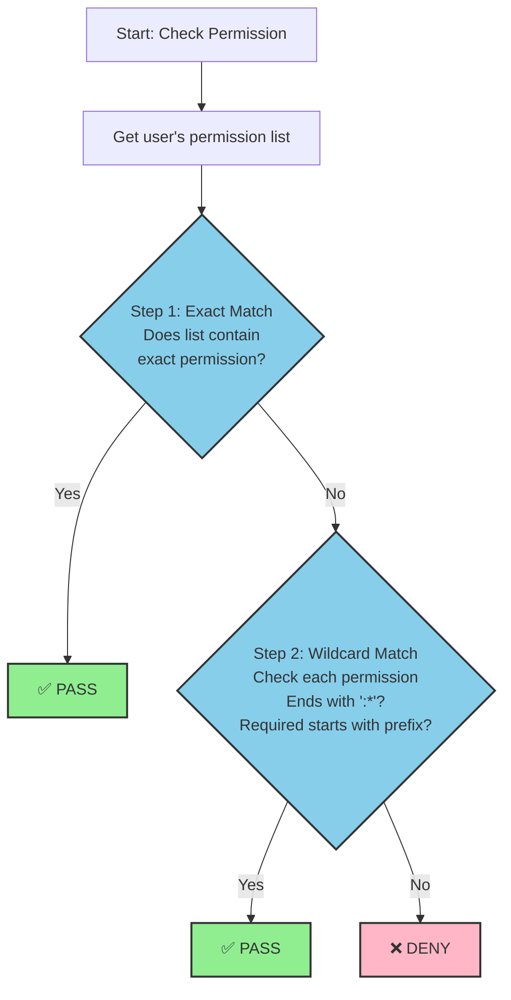

# Permission Matching Rules

## English

### Overview

The `#[sa_check_permission]` macro in sa-token-rust provides a flexible permission checking system that supports both exact matching and wildcard patterns. This document explains how the permission matching algorithm works.

### Basic Concepts

#### Permission Format

Permissions follow the format: `module:action`

Examples:
- `user:list` - View user list
- `user:create` - Create user
- `user:update` - Update user
- `user:delete` - Delete user
- `order:refund` - Refund order

### Matching Rules

#### 1. Exact Match

The system first attempts an exact string match.

```rust
// User has permission
["user:delete"]

// Required permission
"user:delete"

// Result: ✅ Match (exact)
```

**Match Table:**

| User Permission | Required Permission | Result |
|-----------------|---------------------|--------|
| `user:delete`   | `user:delete`       | ✅ Match |
| `user:create`   | `user:delete`       | ❌ No match |
| `order:list`    | `user:delete`       | ❌ No match |

#### 2. Wildcard Match (`*`)

If exact match fails, the system checks for wildcard patterns.

**Module Wildcard:** `module:*`
- Matches all actions in the specified module
- Format: `{prefix}:*`
- Example: `user:*` matches `user:list`, `user:create`, `user:delete`, etc.

```rust
// User has permission
["user:*"]

// Required permissions (all match)
"user:list"    // ✅
"user:create"  // ✅
"user:update"  // ✅
"user:delete"  // ✅

// No match
"order:list"   // ❌ (different module)
```

**Match Table:**

| User Permission | Required Permission | Result |
|-----------------|---------------------|--------|
| `user:*`        | `user:delete`       | ✅ Wildcard match |
| `user:*`        | `user:list`         | ✅ Wildcard match |
| `user:*`        | `user:create`       | ✅ Wildcard match |
| `admin:*`       | `user:delete`       | ❌ No match (different prefix) |
| `order:*`       | `user:list`         | ❌ No match (different prefix) |

#### 3. Global Wildcard (`*`)

A single `*` grants all permissions.

```rust
// User has permission
["*"]

// All permissions match
"user:delete"   // ✅
"order:create"  // ✅
"admin:config"  // ✅
```

**Match Table:**

| User Permission | Required Permission | Result |
|-----------------|---------------------|--------|
| `*`             | `user:delete`       | ✅ Global wildcard |
| `*`             | `order:list`        | ✅ Global wildcard |
| `*`             | `admin:config`      | ✅ Global wildcard |

### Algorithm Flow



### Implementation

The matching logic is implemented in `sa-token-core/src/util.rs`:

```rust
pub async fn has_permission(login_id: impl LoginId, permission: &str) -> bool {
    let manager = Self::get_manager();
    let map = manager.user_permissions.read().await;
    
    if let Some(permissions) = map.get(&login_id.to_login_id()) {
        // 1. Exact match
        if permissions.contains(&permission.to_string()) {
            return true;
        }
        
        // 2. Wildcard match
        for perm in permissions {
            if perm.ends_with(":*") {
                let prefix = &perm[..perm.len() - 2];
                if permission.starts_with(prefix) {
                    return true;
                }
            }
        }
    }
    
    false
}
```

### Usage Examples

#### Example 1: Exact Permission

```rust
use sa_token_core::StpUtil;
use sa_token_macro::sa_check_permission;

// Initialize permissions
StpUtil::set_permissions("user_123", vec![
    "user:list".to_string(),
    "user:create".to_string(),
]).await?;

// Check exact permission
#[sa_check_permission("user:list")]
async fn list_users() -> &'static str {
    let login_id = StpUtil::get_login_id_as_string()?;
    
    // Manual check (recommended)
    if !StpUtil::has_permission(&login_id, "user:list").await {
        return "Permission denied";
    }
    
    "User list"
}
```

#### Example 2: Wildcard Permission

```rust
// Admin has all user module permissions
StpUtil::set_permissions("admin_001", vec![
    "user:*".to_string(),    // All user operations
    "order:*".to_string(),   // All order operations
]).await?;

// These all pass for admin_001
#[sa_check_permission("user:list")]
async fn list_users() { /* ... */ }

#[sa_check_permission("user:create")]
async fn create_user() { /* ... */ }

#[sa_check_permission("user:delete")]
async fn delete_user() { /* ... */ }
```

#### Example 3: Multiple Permissions

```rust
// Check multiple permissions (AND logic)
if StpUtil::has_permissions_and(&login_id, &["user:read", "user:write"]).await {
    println!("Has both read and write permissions");
}

// Check multiple permissions (OR logic)
if StpUtil::has_permissions_or(&login_id, &["admin:*", "user:*"]).await {
    println!("Has admin or user module permissions");
}
```

#### Example 4: Dynamic Permission

```rust
#[sa_check_permission("order:refund")]
async fn refund_order(order_id: u64, amount: f64) -> Result<String, StatusCode> {
    let login_id = StpUtil::get_login_id_as_string()?;
    
    // Dynamic permission based on business logic
    let required_permission = if amount > 1000.0 {
        "order:refund:advanced"  // High-value refunds need advanced permission
    } else {
        "order:refund"
    };
    
    if !StpUtil::has_permission(&login_id, required_permission).await {
        return Err(StatusCode::FORBIDDEN);
    }
    
    Ok(format!("Refunded ${}", amount))
}
```

### Best Practices

#### 1. Permission Naming Convention

Follow the `module:action` format:

```
✅ Good:
- user:list
- user:create
- user:update
- user:delete
- order:create
- order:refund
- admin:config

❌ Bad:
- userList (no separator)
- user_create (wrong separator)
- deleteUser (action first)
```

#### 2. Wildcard Usage

Use wildcards sparingly for administrative roles:

```rust
// Regular user - specific permissions
StpUtil::set_permissions("user_123", vec![
    "user:list".to_string(),
    "user:view".to_string(),
]).await?;

// Admin - module wildcard
StpUtil::set_permissions("admin_001", vec![
    "user:*".to_string(),
    "order:*".to_string(),
]).await?;

// Super admin - global wildcard (use with caution)
StpUtil::set_permissions("superadmin_001", vec![
    "*".to_string(),
]).await?;
```

#### 3. Hierarchical Permissions

Organize permissions hierarchically:

```rust
// Level 1: Module
"user:*"      // All user operations

// Level 2: Action
"user:list"
"user:create"
"user:update"
"user:delete"

// Level 3: Resource-specific (custom implementation)
"user:update:self"     // Only update own profile
"user:update:any"      // Update any user
```

### Performance Considerations

- **Exact Match First:** The system checks exact matches before wildcards, optimizing for the most common case.
- **In-Memory Storage:** Permissions are stored in memory (`HashMap`) for fast access.
- **Async Operations:** All permission checks are async to support Redis or database backends.

### Security Notes

⚠️ **Important:**
1. **Manual Checks Required:** The `#[sa_check_permission]` macro only adds metadata. You must manually call `StpUtil::has_permission()` in your function.
2. **Validate Before Use:** Always check permissions before performing sensitive operations.
3. **Limit Wildcards:** Use global wildcards (`*`) only for super admin accounts.
4. **Audit Trails:** Consider logging permission checks for security auditing.

---

## Related Documentation

- [StpUtil API](/guide/stp-util.md) - Complete StpUtil API reference
- [README](https://github.com/sa-tokens/sa-token-rust) - Project overview and quick start

## 相关文档

- [StpUtil API](/zh/guide/stp-util.md) - 完整的 StpUtil API 参考
- [首页](/zh/) - 项目概述和快速开始

