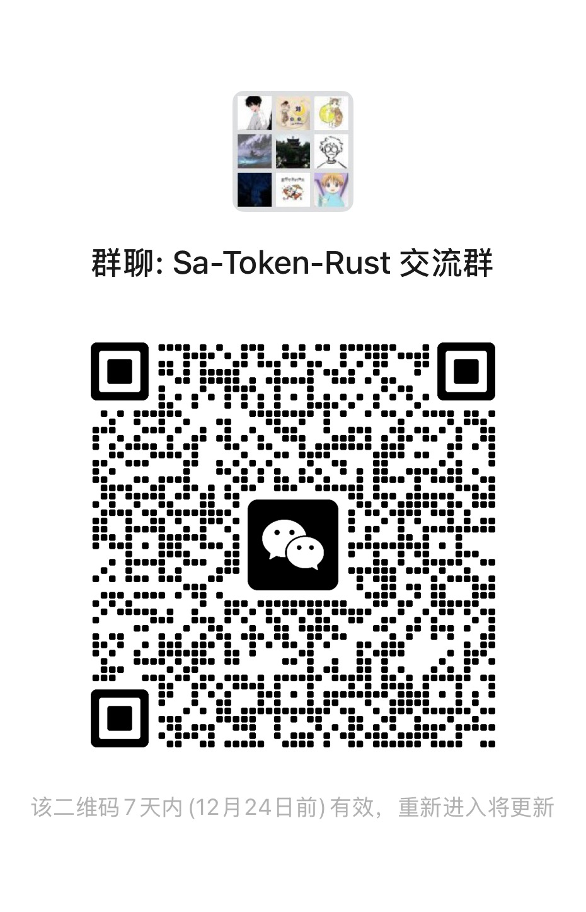

# sa-token-rust

A lightweight, high-performance authentication and authorization framework for Rust, inspired by [sa-token](https://github.com/dromara/sa-token).

<div style="margin: 24px 0;">
  <a href="./zh/" style="display: inline-block; padding: 8px 16px; border: 1px solid #ccc; border-radius: 6px; text-decoration: none; margin-right: 8px;">📖 中文文档</a>
  <a href="./guide/quick-start" style="display: inline-block; padding: 8px 16px; border: 1px solid #ccc; border-radius: 6px; text-decoration: none;">🚀 Quick Start</a>
</div>

## Features

- 🚀 **9 Web Framework Support**: Axum, Actix-web, Poem, Rocket, Warp, Salvo, Tide, Gotham, Ntex
- 🔐 **Complete Authentication**: Login, logout, token validation, session management
- 🛡️ **Fine-grained Authorization**: Permission and role-based access control with wildcard matching
- 💾 **Flexible Storage**: Memory, Redis, and database storage backends
- 🎯 **Easy to Use**: Procedural macros and utility classes for simple integration
- ⚡ **High Performance**: Zero-copy design, async/await support
- 🔧 **Highly Configurable**: Token timeout, cookie options, custom token names
- 🎧 **Event Listeners**: Monitor login, logout, kick-out, and other authentication events
- 🔑 **JWT Support**: Full JWT implementation with 8 algorithms (HS256/384/512, RS256/384/512, ES256/384)
- 🔒 **Security Features**: Nonce for replay attack prevention, refresh token mechanism
- 🌐 **OAuth2 Support**: Complete OAuth2 authorization code flow
- 🌐 **WebSocket Authentication**: Secure WebSocket connection auth with multiple token sources
- 👥 **Online User Management**: Real-time online status tracking and message push
- 🔄 **Distributed Session**: Cross-service session sharing for microservices
- 🎫 **SSO Single Sign-On**: Ticket-based SSO with unified logout

---

## Project Structure

```
sa-token-rust/
├── sa-token-core/                     # Core (Token, Session, Manager, Router)
├── sa-token-adapter/                  # Adapter interfaces (Storage, Request/Response)
├── sa-token-macro/                    # Proc macros (#[sa_check_login], etc.)
├── sa-token-storage-memory/           # Memory storage
├── sa-token-storage-redis/            # Redis storage (+ builder)
├── sa-token-storage-database/         # Database storage (placeholder)
├── sa-token-plugin-actix-web/         # Actix-web facade (v4 default)
├── sa-token-plugin-axum/              # Axum integration (v8)
├── sa-token-plugin-gotham/            # Gotham facade (v074 default)
├── sa-token-plugin-ntex/              # Ntex facade (v212 default)
├── sa-token-plugin-poem/              # Poem integration
├── sa-token-plugin-rocket/            # Rocket facade (v05 default)
├── sa-token-plugin-salvo/             # Salvo facade (v079 default)
├── sa-token-plugin-tide/              # Tide integration
├── sa-token-plugin-warp/              # Warp integration
└── examples/                          # Example projects
```

> **Version-split**: Facade crates use Cargo features to select framework major version at compile time (`v4`/`v5`, `v05`, `v079`, etc.).

## Why sa-token-rust?

### 1. Framework Complexity
9 web frameworks, one unified API. Each plugin provides the same middleware + extractor + token extraction pattern.

### 2. Boilerplate Reduction
Declarative macros eliminate manual auth checks:
```rust
#[sa_check_permission("user:delete")]
async fn delete_user() { /* auto-checked */ }
```

### 3. Session & Token Management
```rust
let token = StpUtil::login("user_10001").await?;
StpUtil::set_roles("user_10001", vec!["admin".into()]).await?;
StpUtil::logout(&token).await?;
```

### 4. Permission & Role System
Built-in wildcard matching (`user:*` matches `user:list`, `user:delete`) with AND/OR logic.

### 5. Distributed & SSO
Cross-service session sharing + ticket-based single sign-on for microservices.

### 6. WebSocket Auth
Dedicated `WsAuthManager` for authenticating WebSocket connections from headers/query/cookies.

### 7. Security
Nonce replay protection, refresh tokens, JWT signing with 8 algorithms.

### 8. Event System
```rust
impl SaTokenListener for MyListener {
    async fn on_login(&self, login_id: &str, token: &str, login_type: &str) {
        // Log, notify, audit
    }
}
StpUtil::register_listener(Arc::new(MyListener));
```

---

## 🚀 Quick Start

Add one dependency and you're ready:

```toml
[dependencies]
sa-token-plugin-axum = "0.1.14"
tokio = { version = "1", features = ["full"] }
axum = "0.8"
```

```rust
use sa_token_plugin_axum::*;
use std::sync::Arc;

#[tokio::main]
async fn main() {
    let state = SaTokenState::builder()
        .storage(Arc::new(MemoryStorage::new()))
        .token_name("Authorization")
        .timeout(86400)
        .build();

    let app = axum::Router::new()
        .route("/user/info", axum::routing::get(user_info))
        .layer(SaTokenMiddleware::new(state));

    let listener = tokio::net::TcpListener::bind("0.0.0.0:3000").await.unwrap();
    axum::serve(listener, app).await.unwrap();
}

async fn user_info(LoginIdExtractor(login_id): LoginIdExtractor) -> String {
    StpUtil::login(&login_id).await.unwrap();
    format!("Current user: {}", login_id)
}
```

**Choose storage with features:**

```toml
# Redis storage
sa-token-plugin-axum = { version = "0.1.14", features = ["redis"] }

# All backends
sa-token-plugin-axum = { version = "0.1.14", features = ["full"] }
```

**Available plugins:** `sa-token-plugin-axum`, `sa-token-plugin-actix-web` (v4 default), `sa-token-plugin-poem`, `sa-token-plugin-rocket` (v05 default), `sa-token-plugin-warp`, `sa-token-plugin-salvo` (v079 default), `sa-token-plugin-tide`, `sa-token-plugin-gotham` (v074 default), `sa-token-plugin-ntex` (v212 default)

➡️ **[Full Quick Start Guide →](/guide/quick-start.md)**

---

## 📖 Basics

Core concepts and APIs you'll use every day.

### StpUtil — The Main API

`StpUtil` is the primary utility class for all authentication and authorization operations:

```rust
use sa_token_core::StpUtil;

// Login
let token = StpUtil::login("user_10001").await?;

// Set permissions and roles
StpUtil::set_permissions("user_10001", vec!["user:list".into(), "user:add".into()]).await?;
StpUtil::set_roles("user_10001", vec!["admin".into()]).await?;

// Check login
StpUtil::is_login_by_login_id("user_10001").await;

// Check permissions
StpUtil::has_permission("user_10001", "user:list").await;
StpUtil::has_role("user_10001", "admin").await;

// Logout
StpUtil::logout(&token).await?;
```

➡️ **[StpUtil API Reference →](/guide/stp-util.md)**

### Proc Macros

8 declarative macros for auth — `#[sa_check_login]`, `#[sa_check_permission]`, `#[sa_check_role]`, AND/OR variants, and `#[sa_ignore]`:

```rust
use sa_token_macro::*;

#[sa_check_login]
async fn protected_route() -> &'static str { "This route requires login" }

#[sa_check_permission("user:delete")]
async fn delete_user(user_id: String) -> &'static str { "User deleted" }

#[sa_check_role("admin")]
async fn admin_only() -> &'static str { "Admin only" }
```

➡️ **[Proc Macros →](/guide/permission-matching)**

### Procedural Macros

```rust
use sa_token_macro::*;

#[sa_check_login]
async fn protected_route() -> &'static str { "This requires login" }

#[sa_check_permission("user:delete")]
async fn delete_user(user_id: String) -> &'static str { "User deleted" }

#[sa_check_role("admin")]
async fn admin_only() -> &'static str { "Admin only" }

#[sa_check_permissions_or("user:read", "user:write")]
async fn user_access() -> &'static str { "Has read or write" }
```

### Event Listeners

Monitor authentication events in real time:

```rust
use sa_token_core::{SaTokenListener, LoggingListener};

struct MyListener;

#[async_trait]
impl SaTokenListener for MyListener {
    async fn on_login(&self, login_id: &str, token: &str, login_type: &str) {
        println!("User {} logged in", login_id);
    }
    async fn on_logout(&self, login_id: &str, token: &str, login_type: &str) {
        println!("User {} logged out", login_id);
    }
    async fn on_kick_out(&self, login_id: &str, token: &str, login_type: &str) {
        println!("User {} was kicked out", login_id);
    }
}

StpUtil::register_listener(Arc::new(MyListener)).await;
```

➡️ **[Event Listener Guide →](/guide/event-listener)**

### Path-Based Authentication

Configure authentication rules based on URL path patterns:

➡️ **[Path Auth Guide →](/guide/path-auth.md)**

### Token Styles

Choose from 9 token generation styles: Uuid, SimpleUuid, Random32/64/128, Jwt, Hash, Timestamp, Tik.

```rust
let config = SaTokenConfig::builder()
    .token_style(TokenStyle::Tik)  // Short 8-char token
    .build_config();
```

➡️ **[Token Styles Reference →](/guide/token-styles.md)**

---

## 🎯 Advanced

### JWT (JSON Web Token)

Full JWT support with 8 algorithms (HS256/384/512, RS256/384/512, ES256/384) and custom claims:

```rust
let config = SaTokenConfig::builder()
    .token_style(TokenStyle::Jwt)
    .jwt_secret_key("your-secret-key")
    .build_config();
```

➡️ **[JWT Guide →](/guide/jwt.md)**

### OAuth2

Complete OAuth2 authorization code flow:

```rust
let oauth2 = OAuth2Manager::new(storage);
let client = OAuth2Client { client_id, client_secret, redirect_uris, grant_types, scope };
oauth2.register_client(&client).await?;
let token = oauth2.exchange_code_for_token(&code, &client_id, &secret, &redirect).await?;
```

➡️ **[OAuth2 Guide →](/guide/oauth2.md)**

### Security Features

Nonce for replay attack prevention and Refresh Token mechanism:

```rust
let nonce_manager = NonceManager::new(storage, 300);
nonce_manager.validate_and_consume(&nonce, "user_123").await?;

let refresh_manager = RefreshTokenManager::new(storage, config);
let (new_token, user_id) = refresh_manager.refresh_access_token(&refresh_token).await?;
```

➡️ **[Security Features →](/guide/security-features.md)**

### WebSocket Authentication

Authenticate WebSocket connections with multiple token sources (header, query, cookie):

➡️ **[WebSocket Authentication →](/guide/websocket-auth.md)**

### Online User Management

Real-time user tracking and message push:

➡️ **[Online User Management →](/guide/online-user-management.md)**

### Distributed Session

Cross-service session sharing for microservices architectures:

➡️ **[Distributed Session →](/guide/distributed-session.md)**

### SSO Single Sign-On

Complete SSO with ticket-based authentication and unified logout:

```rust
let sso_server = SsoServer::new(manager.clone()).with_ticket_timeout(300);
let client = SsoClient::new(manager.clone(), "http://sso.example.com/auth", "http://app1.example.com");
let ticket = sso_server.login("user_123", "http://app1.example.com").await?;
let login_id = sso_server.validate_ticket(&ticket.ticket_id, "http://app1.example.com").await?;
```

➡️ **[SSO Guide →](/guide/sso.md)**

### Custom Storage

Implement the `SaStorage` trait for your own storage backend:

```rust
use sa_token_adapter::storage::SaStorage;

#[async_trait]
impl SaStorage for CustomStorage {
    async fn get(&self, key: &str) -> Option<String> { /* ... */ }
    async fn set(&self, key: &str, value: String, timeout: Option<i64>) { /* ... */ }
    // ... other methods
}
```

### Version-Split Plugin Architecture

Facade crates use Cargo features to select the framework version at compile time:

| Facade Crate | Feature (default) | Binding Crate |
|---|---|---|
| `sa-token-plugin-actix-web` | `v4` | `sa-token-plugin-actix-web-v4` |
| `sa-token-plugin-rocket` | `v05` | `sa-token-plugin-rocket-v05` |
| `sa-token-plugin-salvo` | `v079` | `sa-token-plugin-salvo-v079` |
| `sa-token-plugin-gotham` | `v074` | `sa-token-plugin-gotham-v074` |
| `sa-token-plugin-ntex` | `v212` | `sa-token-plugin-ntex-v212` |

Each also shares a `-core` crate for common logic (state, adapter, error responses).

### Framework Integration

Complete examples for all 9 supported web frameworks:

➡️ **[Framework Integration →](/guide/framework-integration.md)**

### Error Reference

Complete error code reference covering all error types:

➡️ **[Error Reference →](/reference/error-reference.md)**

---

## Supported Languages

All documentation is available in:

- 🇬🇧 English
- 🇨🇳 中文 (Chinese)

---

## License

This project is dual-licensed under:

- **Apache License, Version 2.0** ([LICENSE-APACHE](https://github.com/sa-tokens/sa-token-rust/blob/main/LICENSE-APACHE))
- **MIT License** ([LICENSE-MIT](https://github.com/sa-tokens/sa-token-rust/blob/main/LICENSE-MIT))

You may choose either license at your option.

---

## Community

Scan the QR code to join our WeChat group:



---

**Made with ❤️ by the sa-tokens community**
