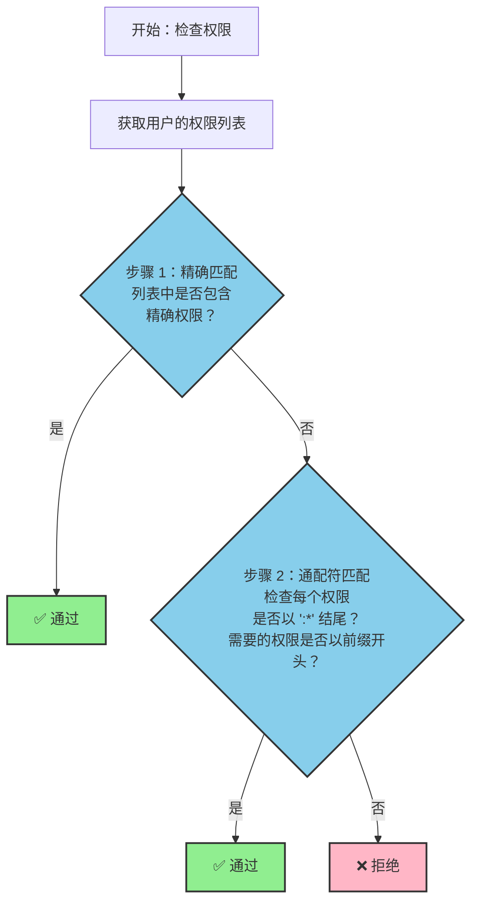

# 权限匹配规则

## 中文

### 概述

sa-token-rust 中的 `#[sa_check_permission]` 宏提供了一个灵活的权限检查系统，支持精确匹配和通配符模式。本文档详细说明了权限匹配算法的工作原理。

### 基本概念

#### 权限格式

权限遵循格式：`模块:操作`

示例：
- `user:list` - 查看用户列表
- `user:create` - 创建用户
- `user:update` - 更新用户
- `user:delete` - 删除用户
- `order:refund` - 退款

### 匹配规则

#### 1. 精确匹配

系统首先尝试精确字符串匹配。

```rust
// 用户拥有的权限
["user:delete"]

// 需要的权限
"user:delete"

// 结果：✅ 匹配（精确）
```

**匹配表：**

| 用户权限      | 需要的权限    | 结果 |
|---------------|---------------|------|
| `user:delete` | `user:delete` | ✅ 匹配 |
| `user:create` | `user:delete` | ❌ 不匹配 |
| `order:list`  | `user:delete` | ❌ 不匹配 |

#### 2. 通配符匹配 (`*`)

如果精确匹配失败，系统会检查通配符模式。

**模块通配符：** `模块:*`
- 匹配指定模块中的所有操作
- 格式：`{前缀}:*`
- 示例：`user:*` 匹配 `user:list`、`user:create`、`user:delete` 等

```rust
// 用户拥有的权限
["user:*"]

// 需要的权限（全部匹配）
"user:list"    // ✅
"user:create"  // ✅
"user:update"  // ✅
"user:delete"  // ✅

// 不匹配
"order:list"   // ❌（不同模块）
```

**匹配表：**

| 用户权限  | 需要的权限    | 结果 |
|-----------|---------------|------|
| `user:*`  | `user:delete` | ✅ 通配符匹配 |
| `user:*`  | `user:list`   | ✅ 通配符匹配 |
| `user:*`  | `user:create` | ✅ 通配符匹配 |
| `admin:*` | `user:delete` | ❌ 不匹配（前缀不同） |
| `order:*` | `user:list`   | ❌ 不匹配（前缀不同） |

#### 3. 全局通配符 (`*`)

单个 `*` 授予所有权限。

```rust
// 用户拥有的权限
["*"]

// 所有权限都匹配
"user:delete"   // ✅
"order:create"  // ✅
"admin:config"  // ✅
```

**匹配表：**

| 用户权限 | 需要的权限     | 结果 |
|----------|---------------|------|
| `*`      | `user:delete` | ✅ 全局通配符 |
| `*`      | `order:list`  | ✅ 全局通配符 |
| `*`      | `admin:config`| ✅ 全局通配符 |

### 算法流程



### 实现代码

匹配逻辑在 `sa-token-core/src/util.rs` 中实现：

```rust
pub async fn has_permission(login_id: impl LoginId, permission: &str) -> bool {
    let manager = Self::get_manager();
    let map = manager.user_permissions.read().await;
    
    if let Some(permissions) = map.get(&login_id.to_login_id()) {
        // 1. 精确匹配
        if permissions.contains(&permission.to_string()) {
            return true;
        }
        
        // 2. 通配符匹配
        for perm in permissions {
            if perm.ends_with(":*") {
                let prefix = &perm[..perm.len() - 2];
                if permission.starts_with(prefix) {
                    return true;
                }
            }
        }
    }
    
    false
}
```

### 使用示例

#### 示例 1：精确权限

```rust
use sa_token_core::StpUtil;
use sa_token_macro::sa_check_permission;

// 初始化权限
StpUtil::set_permissions("user_123", vec![
    "user:list".to_string(),
    "user:create".to_string(),
]).await?;

// 检查精确权限
#[sa_check_permission("user:list")]
async fn list_users() -> &'static str {
    let login_id = StpUtil::get_login_id_as_string()?;
    
    // 手动检查（推荐）
    if !StpUtil::has_permission(&login_id, "user:list").await {
        return "权限不足";
    }
    
    "用户列表"
}
```

#### 示例 2：通配符权限

```rust
// 管理员拥有所有用户模块权限
StpUtil::set_permissions("admin_001", vec![
    "user:*".to_string(),    // 所有用户操作
    "order:*".to_string(),   // 所有订单操作
]).await?;

// admin_001 可以访问以下所有接口
#[sa_check_permission("user:list")]
async fn list_users() { /* ... */ }

#[sa_check_permission("user:create")]
async fn create_user() { /* ... */ }

#[sa_check_permission("user:delete")]
async fn delete_user() { /* ... */ }
```

#### 示例 3：多个权限

```rust
// 检查多个权限（AND 逻辑）
if StpUtil::has_permissions_and(&login_id, &["user:read", "user:write"]).await {
    println!("同时拥有读写权限");
}

// 检查多个权限（OR 逻辑）
if StpUtil::has_permissions_or(&login_id, &["admin:*", "user:*"]).await {
    println!("拥有管理员或用户模块权限");
}
```

#### 示例 4：动态权限

```rust
#[sa_check_permission("order:refund")]
async fn refund_order(order_id: u64, amount: f64) -> Result<String, StatusCode> {
    let login_id = StpUtil::get_login_id_as_string()?;
    
    // 根据业务逻辑动态决定权限
    let required_permission = if amount > 1000.0 {
        "order:refund:advanced"  // 大额退款需要高级权限
    } else {
        "order:refund"
    };
    
    if !StpUtil::has_permission(&login_id, required_permission).await {
        return Err(StatusCode::FORBIDDEN);
    }
    
    Ok(format!("已退款 ¥{}", amount))
}
```

### 最佳实践

#### 1. 权限命名规范

遵循 `模块:操作` 格式：

```
✅ 正确：
- user:list
- user:create
- user:update
- user:delete
- order:create
- order:refund
- admin:config

❌ 错误：
- userList（没有分隔符）
- user_create（错误的分隔符）
- deleteUser（操作在前）
```

#### 2. 通配符使用

谨慎使用通配符，仅用于管理员角色：

```rust
// 普通用户 - 具体权限
StpUtil::set_permissions("user_123", vec![
    "user:list".to_string(),
    "user:view".to_string(),
]).await?;

// 管理员 - 模块通配符
StpUtil::set_permissions("admin_001", vec![
    "user:*".to_string(),
    "order:*".to_string(),
]).await?;

// 超级管理员 - 全局通配符（谨慎使用）
StpUtil::set_permissions("superadmin_001", vec![
    "*".to_string(),
]).await?;
```

#### 3. 分层权限

按层次组织权限：

```rust
// 层级 1：模块
"user:*"      // 所有用户操作

// 层级 2：操作
"user:list"
"user:create"
"user:update"
"user:delete"

// 层级 3：资源特定（自定义实现）
"user:update:self"     // 只能更新自己的资料
"user:update:any"      // 可以更新任何用户
```

### 性能考虑

- **精确匹配优先：** 系统先检查精确匹配，优化最常见的情况
- **内存存储：** 权限存储在内存（`HashMap`）中以实现快速访问
- **异步操作：** 所有权限检查都是异步的，支持 Redis 或数据库后端

### 安全注意事项

⚠️ **重要：**
1. **需要手动检查：** `#[sa_check_permission]` 宏只添加元数据，必须在函数中手动调用 `StpUtil::has_permission()`
2. **使用前验证：** 在执行敏感操作前始终检查权限
3. **限制通配符：** 仅对超级管理员账户使用全局通配符 (`*`)
4. **审计跟踪：** 考虑记录权限检查日志以进行安全审计

---


## Related Documentation

- [StpUtil API](/zh/guide/stp-util.md) - Complete StpUtil API reference
- [README](https://github.com/sa-tokens/sa-token-rust) - Project overview and quick start

## 相关文档

- [StpUtil API](/zh/guide/stp-util.md) - 完整的 StpUtil API 参考
- [首页](/zh/) - 项目概述和快速开始

